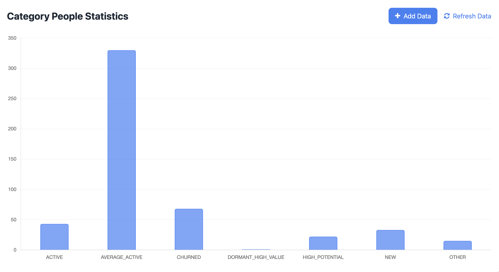

## Background

User segmentation in e-commerce is the operational method of dividing users into similar subgroups based on their characteristics, behaviors, or needs. It enables platforms to achieve precise marketing, optimize product categories, and provide personalized experiences. Additionally, it supports stratified operation throughout the user lifecycle and competitive analysis, serving as the core foundation for refined e-commerce operations and enhancing efficiency and user value.

### **I. Customer Segmentation Framework**

In this demo, we adopt a dual-dimensional strategy combining the **RFM model** (reflecting historical value) and **Behavioral Patterns** (reflecting current activity):

1. **RFM Dimensions**:
    - **Recency**: `last_order_time` (time since last purchase)
    - **Monetary**: `total_spent` (cumulative spending)
2. **Behavioral Pattern Dimensions**:
    - **Frequency**: `view_count` , `cart_count`, `purchase_count`

### **II.** Segmentation **Strategies**

1. **Active Customers (High RFM + High Activity)**

   **Characteristics**: Recent purchases, frequent buying, high spending, active browsing

2. **High Potential Customers (High browse/cart, no purchase)**

   **Characteristics**: High views, multiple cart additions, no checkout

3. **Dormant High Value Customers (High historical value, low activity)**

   **Characteristics**: High past spending, no activity for 60+ days

4. **New Customers (First purchase within 7 days)**

   **Characteristics**: Recent first-time buyers

5. **Ordinary Customers (Moderate RFM scores)**

   **Characteristics**: Regular but moderate purchasing

6. **Churned Customers (Low activity & low historical value)**

   **Characteristics**: Long inactivity and low spending history


## **Launch The Demo**

### **Prerequisites**

Ensure that [RisingWave](https://docs.risingwave.com/get-started/quickstart) and [Kafka](https://kafka.apache.org/) have been successfully installed!

### **Quick Start**

1. **Clone the Repository.**

    ```
    git clone <https://github.com/risingwavelabs/awesome-stream-processing.git>
    ```

2. **Go to the demo directory.**

    ```
    cd e-commerce
    ```

3. **Run the shell script to create Kafka topics and RisingWave database tables.**

    ```
    sh create_tables.sh
    ```

4. **Start the Python script that simulates data generation.**

    ```
    pip install -r requirements.txt
    Python generate_data.py
    ```

5. **Start the server.**

    ```
    Python customer_segmentation.py
    ```

6. **Launch the dashboard**

   Open `customer_segmentation.html` in your browser.


## Visualization

We display the total number of users in all segmented groups using a bar chart, and this dashboard supports real-time addition of user data.




## Data Flow

### Overview


### **1 -** Data Collection

**Data source:** All users' click events on the E-Shop pages

- Front-end tracking, e.g. button clicks, page views.. (event stream)
- Order system pushing real-time status updates (order stream)

**User Events:**

- view events: Generate a click record while users browsing the pages.
- Cart events: Generate a click record while users add products to the shopping cart.
- Purchase events: Generate both a click record and a order record while users buy products.

Every user behavior event generates a record that will be sent to **Kafka**.

**Sample data:**

```json
// Click stream (events: view, cart, purchase)
{
    "user_id": "U12345",
    "event_id": "E1234",
    "event_type": "view",
    "page_url": "/clothing/t-shirt",
    "product_id": "P001",
    "price": 199.99,
    "product_name": "Cotton T-Shirt",
    "event_time": "2025-06-27T14:30:21Z"
  }

// Order stream (events: purchase)
{
	"order_id": "12345",
	"event_id": "E23456",
	"user_id": "U12345",
	"order_status": "paid",
	"price": 199.99,
	"order_time": "2025-06-27T14:30:21Z"
}
```

>
> For convenience in this demo, we directly used a Python script to simulate and generate data from the past three months.
>

### 2 - Data Ingestion

One order stream corresponds to one purchase event stream, and the two tables are associated through the `event_id`.


**RisingWave** will read data from **Kafka** and store it in the **Source** Table.

```sql
-- User behavior source
CREATE SOURCE event_stream (
    user_id VARCHAR,
    event_id VARCHAR,
    event_type VARCHAR,
    product_id VARCHAR,
    product_name VARCHAR,
    price DOUBLE PRECISION,
    event_time TIMESTAMP,
    page_url VARCHAR
) WITH (
    connector = 'kafka',
    topic = 'clickstream',
    properties.bootstrap.server = 'kafka:9092'
) FORMAT PLAIN ENCODE JSON;

-- Orders source
CREATE SOURCE order_stream (
    order_id VARCHAR,
    user_id VARCHAR,
    event_id VARCHAR,
    order_status VARCHAR,
    price DOUBLE PRECISION,
    order_time TIMESTAMP
) WITH (
    connector = 'kafka',
    topic = 'order_events',
    properties.bootstrap.server = 'kafka:9092'
) FORMAT PLAIN ENCODE JSON;
```

### 3 - Stats Data Features

Since we use the **RFM Model** and **Behavior Pattern Model** to segment customer groups, we need to calculate the following data **features** here for scoring purposes.

1. User events count
    - Count separately the number of times users browse the pages, add items to the shopping cart, and purchase products.
    - Used to evaluate user activity levels.
2. Total spent
    - Used to evaluate users' consumption capacity.
3. Last Order Time
    - Used to evaluate users' recent consumption situation.

With the help of **RisingWave**'s **Materialized Views**, we can calculate each user's behavioral characteristics in real time.

```sql
-- Calculate user behavior statistics
CREATE MATERIALIZED VIEW click_behavior_stats AS
SELECT
    user_id,
    COUNT(*) FILTER (WHERE event_type = 'view') AS view_count,
    COUNT(*) FILTER (WHERE event_type = 'cart') AS cart_count,
    COUNT(*) FILTER (WHERE event_type = 'purchase') AS purchase_count
FROM event_stream
WHERE event_time >= CURRENT_TIMESTAMP - INTERVAL '2 months'
GROUP BY user_id;

-- Calculate order status statistics
CREATE MATERIALIZED VIEW user_order_stats AS
SELECT
    1 AS id,
    user_id,
    COUNT(*) FILTER (WHERE order_status = 'completed') AS completed_orders,
    SUM(price) AS total_spent,
    MAX(order_time) AS last_order_time
FROM order_stream
GROUP BY user_id;

-- Calculate global max order time
CREATE MATERIALIZED VIEW global_order_stats AS
SELECT
    1 AS id,
    MAX(order_time) AS max_order_time
FROM order_stream;

CREATE MATERIALIZED VIEW order_behavior_stats AS
SELECT
    u.user_id AS user_id,
    u.completed_orders AS completed_orders,
    u.total_spent AS total_spent,
    u.last_order_time AS last_order_time,
    g.max_order_time AS max_order_time
FROM user_order_stats u
JOIN global_order_stats g
ON u.id = g.id;
```

>
> It should be noted here that **RisingWave** does not support **streaming nested loops with non-equijoin**. Therefore, when connecting these two **MV**s here, we need to specify an additional attribute.
>

### 4 - Scoring

**1. RFM Scoring**

RFM Score is based on users' recent order status.

```sql
CREATE MATERIALIZED VIEW rfm_scores AS
SELECT
    user_id,
    -- Recency Score: Recent purchases get higher scores
    CASE
    WHEN max_order_time - last_order_time <= INTERVAL '3 days' THEN 5
    WHEN max_order_time - last_order_time <= INTERVAL '10 days' THEN 4
    WHEN max_order_time - last_order_time <= INTERVAL '30 days' THEN 3
    WHEN max_order_time - last_order_time <= INTERVAL '60 days' THEN 2
    ELSE 1
END AS r_score,
    -- Frequency Score: Higher purchase frequency gets higher scores
    CASE
        WHEN completed_orders >= 15 THEN 5
        WHEN completed_orders >= 8 THEN 4
        WHEN completed_orders >= 5 THEN 3
        WHEN completed_orders >= 2 THEN 2
        ELSE 1
END AS f_score,
    -- Monetary Score: Higher spending gets higher scores
    CASE
        WHEN total_spent >= 5000 THEN 5
        WHEN total_spent >= 2500 THEN 4
        WHEN total_spent >= 1000 THEN 3
        WHEN total_spent >= 200 THEN 2
        ELSE 1
END AS m_score
FROM order_behavior_stats;
```

**2. Behavioral Pattern Scoring**

```sql
CREATE MATERIALIZED VIEW behavior_scores AS
SELECT
    u.user_id,
    -- Browsing Activity Score
    CASE
        WHEN view_count >= 30 THEN 5
        WHEN view_count >= 15 THEN 4
        WHEN view_count >= 8 THEN 3
        WHEN view_count >= 2 THEN 2
        ELSE 1
        END AS browse_score,
    -- Purchase Intent Score
    CASE
        WHEN cart_count >= 10 THEN 5
        WHEN cart_count >= 7 THEN 4
        WHEN cart_count >= 4 THEN 3
        WHEN cart_count >= 2 THEN 2
        ELSE 1
        END AS intent_score
FROM click_behavior_stats u
```

### 5 - Customer Segmentation

Segment based on users' RFM scores and behavior pattern scores. The segmentation strategy has been mentioned in the above text. We still use **RisingWave**'s **Materialized View** to perform real-time calculations.

```sql
CREATE MATERIALIZED VIEW customer_segmentation AS
SELECT
    b.user_id,
    b.browse_score AS browse_score,
    b.intent_score AS intent_score,
    COALESCE(r.r_score, 1) AS r_score,
    COALESCE(r.f_score, 1) AS f_score,
    COALESCE(r.m_score, 1) AS m_score,
    CASE
        -- High-value active customers (high RFM + high activity)
        WHEN r_score >= 4 AND f_score >= 4 AND m_score >= 4
            AND browse_score >= 3 THEN 'ACTIVE'
        -- New customers (first purchase within 7 days)
        WHEN r_score >= 4 AND f_score = 1 THEN 'NEW'
        -- High-potential customers (high browse/cart but no purchase)
        WHEN browse_score >= 4 AND intent_score >= 3 AND COALESCE(r_score, 1) <= 2 THEN 'HIGH_POTENTIAL'
        -- Dormant high-value customers (low activity but high historical value)
        WHEN COALESCE(r_score, 1) <= 2 AND m_score >= 4 THEN 'DORMANT_HIGH_VALUE'
        -- Average active customers
        WHEN r_score >= 2 AND f_score >= 2 AND m_score >= 2 THEN 'AVERAGE_ACTIVE'
        -- Churned customers
        WHEN COALESCE(r_score, 1) <= 2 AND COALESCE(f_score, 1) <= 2 THEN 'CHURNED'
        ELSE 'OTHER'
        END AS segment
FROM behavior_scores b
LEFT JOIN rfm_scores r
ON r.user_id = b.user_id;
```

The scoring and segmentation criteria in this demo have been tested and demonstrated excellent performance, and the user groups segmented based on these scores are consistent with the actual situation.

### 6 - Visualization

Read the user group segmentation from the `customer_segmentation` **MV** via a Python script and send it to the frontend for display.

```sql
SELECT count(*), segment 
FROM customer_segmentation   
GROUP by segment
ORDER BY segment;
```

Here, we use Flask to build a lightweight server, which facilitates interaction with the frontend page and handles data addition requests.
