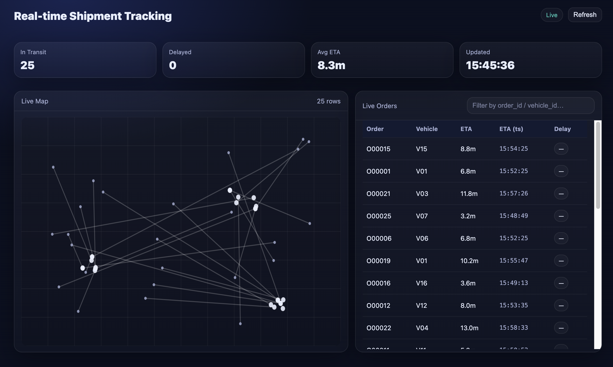
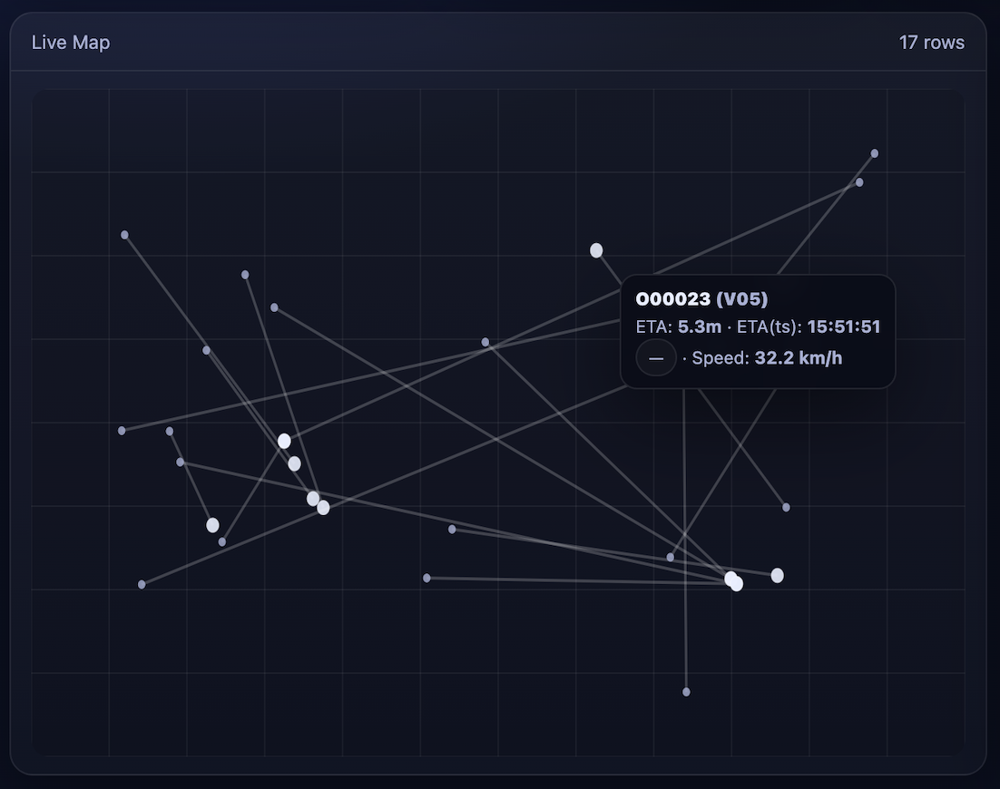
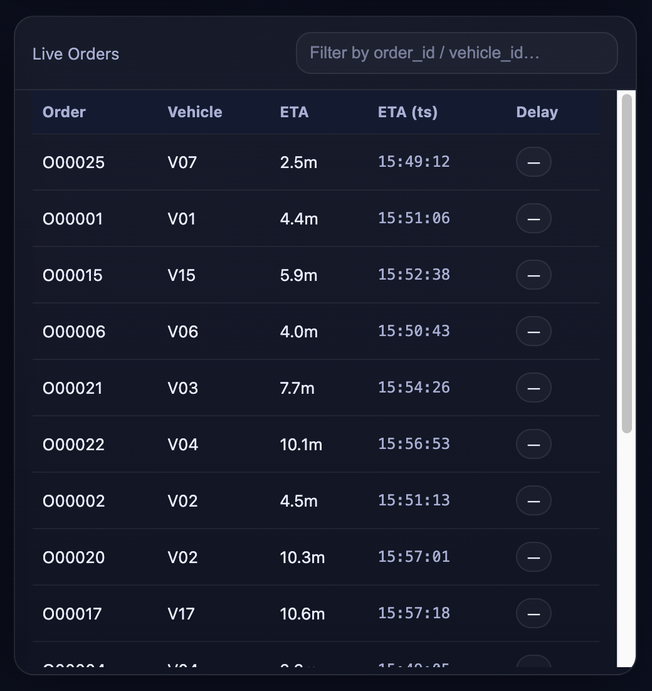
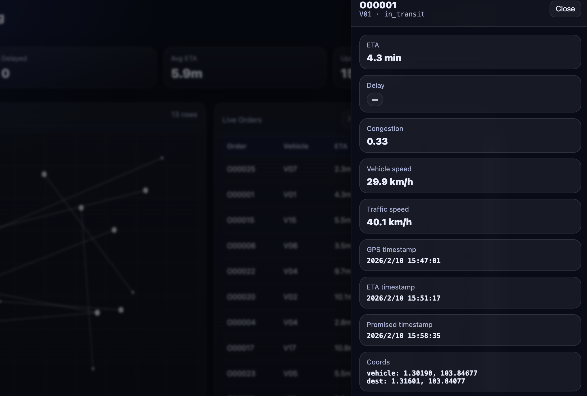

## Background

In modern logistics systems, real-time shipment visibility is a core operational requirement. Delivery vehicles continuously stream GPS updates, traffic conditions change throughout the day, and every order comes with a promised delivery deadline. The challenge is no longer just knowing where a shipment is, but continuously determining whether it will arrive on time and detecting potential delays as early as possible.

Traditional solutions struggle to meet this need. Batch-based pipelines introduce latency, producing ETAs that are already outdated when they are delivered. Building fully custom streaming systems, on the other hand, requires complex state management and significant operational overhead. This demo addresses that gap by using Kafka and RisingWave to build a SQL-native, real-time pipeline that continuously maintains the current truth of each shipment, including its location, traffic context, predicted arrival time, and delay status—without complex stream-processing code.


## QuickStart

### Prerequisites

Ensure that [RisingWave](https://docs.risingwave.com/get-started/quickstart) and [Kafka](https://kafka.apache.org/) have been successfully installed!

### Quick Start

1. **Clone the Repository.**

   ```shell
   git clone <https://github.com/risingwavelabs/awesome-stream-processing.git>
   ```

2. **Go to the demo directory.**

   ```shell
   cd shipment_tracking
   ```

3. **Run the initial shell script to create Kafka topics and tables in RisingWave.**

   ```shell
   sh initialize.sh
   ```

4. **Run the js script to mock data.**

   ```shell
   node simulate_data.js
   ```

5. **Run the Backedend Server.**

   ```
   node server.js
   ```

6. **Launch the dashboard.**

   Open `dashboard.html` in your browser.


## Visualization

### Interface preview



### The KPI section


### Live map



### Order list



### Detail panel




## **The Technical Architecture**

The end-to-end data flow:


### **Step 1: Ingest Three Real-Time Streams from Kafka**

The pipeline starts by ingesting three Kafka topics into RisingWave as stream tables.

`gps_stream` represents raw GPS updates from vehicles. Each message carries a timestamp, vehicle identifier, coordinates, and instantaneous speed.

```sql
-- 1) GPS stream (JSON)
CREATE TABLE sc.gps_raw (
    event_ts TIMESTAMPTZ,
    vehicle_id VARCHAR,
    lat DOUBLE PRECISION,
    lon DOUBLE PRECISION,
    speed_kmh DOUBLE PRECISION
) WITH (
    connector = 'kafka',
    topic = 'gps_stream',
    properties.bootstrap.server = '127.0.0.1:9092',
    scan.startup.mode = 'earliest'
) FORMAT PLAIN ENCODE JSON;
```

`traffic_stream` represents traffic snapshots. Each traffic event is keyed by a region_id and includes a bounding box along with congestion and speed.

```sql
-- 2) Traffic stream (JSON)
CREATE TABLE sc.traffic_raw (
    event_ts TIMESTAMPTZ,
    region_id VARCHAR,
    min_lat DOUBLE PRECISION,
    min_lon DOUBLE PRECISION,
    max_lat DOUBLE PRECISION,
    max_lon DOUBLE PRECISION,
    congestion DOUBLE PRECISION,
    traffic_speed_kmh DOUBLE PRECISION
) WITH (
    connector = 'kafka',
    topic = 'traffic_stream',
    properties.bootstrap.server = '127.0.0.1:9092',
    scan.startup.mode = 'earliest'
) FORMAT PLAIN ENCODE JSON;
```

`order_stream` represents operational order updates, includes the order’s destination, promised delivery timestamp, current status, and update time. This stream is what turns vehicle movement into a shipment-tracking problem: it binds each order to its SLA and destination.

```sql
-- 3) Order updates stream (JSON)
CREATE TABLE sc.order_updates_raw (
    order_id VARCHAR,
    vehicle_id VARCHAR,
    dest_lat DOUBLE PRECISION,
    dest_lon DOUBLE PRECISION,
    promised_ts TIMESTAMPTZ,
    status VARCHAR,
    updated_at TIMESTAMPTZ
) WITH (
    connector = 'kafka',
    topic = 'order_stream',
    properties.bootstrap.server = '127.0.0.1:9092',
    scan.startup.mode = 'earliest'
) FORMAT PLAIN ENCODE JSON;
```

### **Step 2: Normalize Streams into Typed Events and a Shared Spatial Key**

Raw streams are already structured, but the pipeline still normalizes them into typed event views that add one critical field: a shared spatial key `grid_id`.

For GPS events, `grid_id` is computed by snapping latitude and longitude into a small grid using 0.002 degree buckets, then concatenating the bucketed lat/lon into a string. And for traffic events, `grid_id` is computed from the **center point** of the traffic region’s bounding box, snapped using the same grid rule. This makes GPS and traffic events joinable using a simple equality key instead of expensive spatial predicates.

```sql
-- GPS events (typed)
CREATE MATERIALIZED VIEW sc.gps_events AS
SELECT
    event_ts,
    vehicle_id,
    lat,
    lon,
    speed_kmh,
    (
      CAST(FLOOR(lat / 0.002) AS BIGINT)::TEXT
      || '_' ||
      CAST(FLOOR(lon / 0.002) AS BIGINT)::TEXT
    ) AS grid_id
FROM sc.gps_raw;

-- GPS events (typed)
CREATE MATERIALIZED VIEW sc.traffic_events AS
SELECT
    event_ts,
    region_id,
    min_lat,
    min_lon,
    max_lat,
    max_lon,
    congestion,
    traffic_speed_kmh,
    (
      CAST(FLOOR(((min_lat + max_lat) / 2) / 0.002) AS BIGINT)::TEXT
      || '_' ||
      CAST(FLOOR(((min_lon + max_lon) / 2) / 0.002) AS BIGINT)::TEXT
    ) AS grid_id
FROM sc.traffic_raw;
```

### **Step 3: Convert Event Streams into Latest State Snapshots**

Real-time dashboards and ETA computation need the current state, not a full append-only history, so we create three snapshots using row_number() over a time ordering and keeping exactly one row.

```sql
-- Latest order snapshot (one row per order_id), e.g., order snapshot
CREATE MATERIALIZED VIEW sc.orders AS
SELECT
    order_id,
    vehicle_id,
    dest_lat,
    dest_lon,
    promised_ts,
    status,
    updated_at
FROM (
    SELECT *, row_number() OVER (PARTITION BY order_id ORDER BY updated_at DESC) AS rn
    FROM sc.order_updates
) t
WHERE rn = 1;
```

This is one of the places where RisingWave matters: materialized views maintain these “latest” snapshots continuously and incrementally. Every new Kafka message updates only the affected keys, keeping these state tables always fresh for downstream joins.

### **Step 4: Join Current Order + Vehicle + Traffic into One Live Operational Row**

With the latest-state tables in place, we join the three tables using `vehicle_id` and `grid_id`. To ensure the ETA pipeline remains stable even when traffic signals are sparse, the join defines two important defaults. If traffic data is missing, `congestion` falls back to 0.0, and `traffic_speed_kmh` falls back to the vehicle’s own speed.

```sql
WITH joined AS (
    SELECT
        o.order_id,
        o.vehicle_id,
        o.status,
        o.dest_lat,
        o.dest_lon,
        o.promised_ts,
        o.updated_at,

        v.lat AS vehicle_lat,
        v.lon AS vehicle_lon,
        v.speed_kmh AS vehicle_speed_kmh,
        v.gps_ts,
        v.grid_id,

        t.region_id,
        coalesce(t.congestion, 0.0) AS congestion,
        coalesce(t.traffic_speed_kmh, v.speed_kmh) AS traffic_speed_kmh
    FROM sc.orders o
        JOIN sc.vehicle_latest v ON o.vehicle_id = v.vehicle_id
        LEFT JOIN sc.traffic_latest t ON v.grid_id = t.grid_id
)
```

### **Step 5: Compute Distance, Effective Speed, ETA, ETA Timestamp, and Delay**

`calc_dist` computes the Haversine distance in kilometers between the vehicle’s current coordinates and the order destination. This produces `distance_km`, which is the foundation for travel time.

```sql
calc_dist AS (
    SELECT
        *,
        -- Haversine distance (km)
        (2 * 6371 * asin(
          sqrt(
            power(sin(radians(dest_lat - vehicle_lat)/2), 2) +
            cos(radians(vehicle_lat)) * cos(radians(dest_lat)) *
            power(sin(radians(dest_lon - vehicle_lon)/2), 2)
          )
        )) AS distance_km
    FROM joined
)
```

`calc_speed` converts raw speed signals into an effective speed. It takes the minimum of vehicle speed and traffic speed, applies a congestion penalty $1 - congestion \times 0.6$, and floors the result at 5.0 km/h to avoid unstable ETAs at extremely low speeds. This yields `effective_speed_kmh`.

```sql
calc_speed AS (
    SELECT
        *,
        -- Effective speed (km/h), floor at 5
        greatest(
          5.0,
          least(vehicle_speed_kmh, traffic_speed_kmh) * (1 - congestion * 0.6)
        ) AS effective_speed_kmh
    FROM calc_dist
)
```

`calc_eta` converts distance and effective speed into minutes using $\frac{distance\_km}{ effective\_speed\_kmh} \times 60.0$ and outputs `eta_minutes`.

```sql
calc_eta AS (
    SELECT
        *,
        -- Travel time (minutes)
        (distance_km / effective_speed_kmh * 60.0) AS eta_minutes
    FROM calc_speed
)
```

The SELECT computes the two business-critical timestamps. The predicted arrival timestamp `eta_ts` is computed as $gps\_ts + eta\_minutes \times 1\ minute$, which ties ETA to the real event time of the latest GPS update. Delay is computed as an interval $delay\_interval = eta\_ts - promised\_ts$: a positive interval means the shipment is predicted to arrive after its promised deadline.

```sql
SELECT
    order_id,
    vehicle_id,
    status,
    dest_lat, dest_lon,
    promised_ts,
    updated_at,

    vehicle_lat, vehicle_lon,
    vehicle_speed_kmh,
    gps_ts,
    grid_id,

    region_id,
    congestion,
    traffic_speed_kmh,

    distance_km,
    effective_speed_kmh,
    eta_minutes,

    -- ETA timestamp based on event time
    (gps_ts + (eta_minutes * INTERVAL '1 minute')) AS eta_ts,

    -- Delay vs promised time (interval)
    ((gps_ts + (eta_minutes * INTERVAL '1 minute')) - promised_ts) AS delay_interval
FROM calc_eta;
```

This entire chain is maintained as a materialized view. New GPS messages, traffic changes, or order updates cause RisingWave to incrementally update only affected orders, keeping the mv always ready for the dashboard to query.