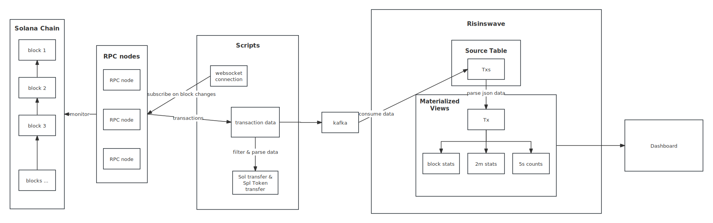
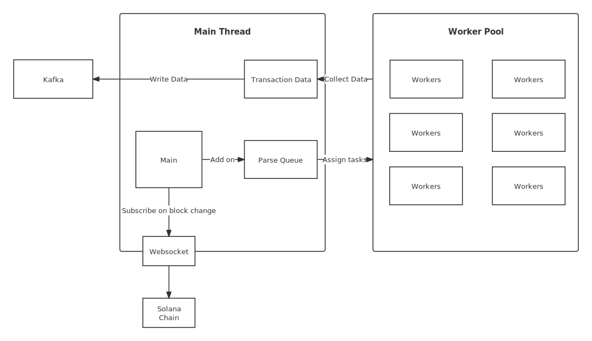

## Background

In the world of Web3, the Solana blockchain operates at an incredible velocity, processing thousands of transactions per second. This constant flood of on-chain data is a goldmine for developers, analysts, and builders. But it also presents a massive technical challenge to capture, parse, and visualize this data in real-time.

Traditional batch processing is too slow, leaving hours or even days behind. Many real-time solutions are resource-intensive and struggle to keep up. This is the problem we set out to solve.

We developed a demo that pairs the high-throughput capabilities of Solana with the stream processing power of RisingWave. The result is a simple, efficient, and powerful real-time dashboard that transforms raw on-chain data into actionable insights, instantly.

This isn't just another analytics tool. It’s a blueprint for building data-driven applications on the blockchain, powered by a streaming database that makes real-time easy.


## Launch This Demo

### Prerequisites

Ensure that [RisingWave](https://docs.risingwave.com/get-started/quickstart) and [Kafka](https://kafka.apache.org/) have been successfully installed!

### Quick Start

1. **Clone the Repository.**

   ```shell
   git clone <https://github.com/risingwavelabs/awesome-stream-processing.git>
   ```

2. **Go to the demo directory.**

   ```
   cd solana_analysis
   ```

3. **Run the initial shell script to create Kafka topics and RisingWave database tables.**

   ```
   sh initial.sh
   ```

4. **Run the Solana Server to get transaction data.**

   ```shell
   node solana/index.js
   ```

5. **Start the Backedend Server.**

   ```shell
   node server/index.js
   ```

6. **Launch the dashboard.**

   ```shell
   cd client
   npm run dev
   ```


## Visualization

1. **Live Block-by-Block Analysis**

   

​	*The dashboard displays core metrics for both SOL Native Transfers and SPL Token Transfers across the 15 most recent blocks.*

2. **2-Minute Transfer Overview**

   

3. **The 5-Second Transaction Count**

​	


## The Architecture of this demo

**The data flow picture:**



1. **Data Capture (Solana RPC):**

    The system connects to Solana RPC nodes via WebSocket to capture every block change and transaction detail in near real-time.

2. **Data Processing & Parsing:** 

   A custom script purifies the raw blockchain data, filtering for key events like SOL and SPL-Token transfers. This transforms raw bytes into a structured, analyzable format. The script uses a worker pool for parallel processing to keep up with Solana's speed. The collected data will then be sent to a Kafka topic.

​	

3. **Streaming Engine (RisingWave)**:

   - **Data Ingestion:** Data is streamed into RisingWave from Kafka. 

   - **Transformation with SQL:** 

     - Convert the raw JSON data into a relational table structure with the following SQL query:

       ```sql
       CREATE MATERIALIZED VIEW tx AS
       SELECT
           tx->>'slot'                         AS slot,
           (tx->>'blockTime')::TIMESTAMPTZ     AS blockTime,
           tx->>'tx_type'                      AS tx_type,
           tx->>'signature'                    AS signature,
           tx->>'sender'                       AS sender,
           tx->>'receiver'                     AS receiver,
           (tx->>'amount')::NUMERIC            AS amount,
           tx->>'fee'                          AS fee
       FROM (
           SELECT jsonb_array_elements(transactions) AS tx
           FROM txs
           );
       ```

     - **Incremental Computation (Materialized Views):** Use Risingwave's materialized views to incrementally update results as new data arrives. If the item is not included in the statistical results, we set it to 0.

       ```sql
       -- block stats mv
       CREATE MATERIALIZED VIEW block_stats AS
       SELECT slot,
              COUNT(CASE WHEN tx_type = 'SOL Transfer' THEN 1 END)                              AS sol_tx_count,
              COALESCE(SUM(CASE WHEN tx_type = 'SOL Transfer' THEN amount END), 0)              AS sol_total_amount,
              COALESCE(ROUND(AVG(CASE WHEN tx_type = 'SOL Transfer' THEN amount END), 0))       AS sol_avg_amount,
              COALESCE(MAX(CASE WHEN tx_type = 'SOL Transfer' THEN amount END), 0)              AS sol_max_amount,
              COALESCE(MIN(CASE WHEN tx_type = 'SOL Transfer' THEN amount END), 0)              AS sol_min_amount,
       
              COUNT(CASE WHEN tx_type = 'SPL-Token Transfer' THEN 1 END)                        AS spl_tx_count,
              COALESCE(SUM(CASE WHEN tx_type = 'SPL-Token Transfer' THEN amount END), 0)        AS spl_total_amount,
              COALESCE(ROUND(AVG(CASE WHEN tx_type = 'SPL-Token Transfer' THEN amount END), 0)) AS spl_avg_amount,
              COALESCE(MAX(CASE WHEN tx_type = 'SPL-Token Transfer' THEN amount END), 0)        AS spl_max_amount,
              COALESCE(MIN(CASE WHEN tx_type = 'SPL-Token Transfer' THEN amount END), 0)        AS spl_min_amount
       FROM tx
       GROUP BY slot;
       
       -- 2m stats mv
       CREATE MATERIALIZED VIEW tx_2min_stats AS
       SELECT window_start,
              window_end,
       
              COUNT(CASE WHEN tx_type = 'SOL Transfer' THEN 1 END)                              AS sol_tx_count,
              COALESCE(SUM(CASE WHEN tx_type = 'SOL Transfer' THEN amount END), 0)              AS sol_total_amount,
              COALESCE(ROUND(AVG(CASE WHEN tx_type = 'SOL Transfer' THEN amount END), 0))       AS sol_avg_amount,
              COALESCE(MAX(CASE WHEN tx_type = 'SOL Transfer' THEN amount END), 0)              AS sol_max_amount,
              COALESCE(MIN(CASE WHEN tx_type = 'SOL Transfer' THEN amount END), 0)              AS sol_min_amount,
       
              COUNT(CASE WHEN tx_type = 'SPL-Token Transfer' THEN 1 END)                        AS spl_tx_count,
              COALESCE(SUM(CASE WHEN tx_type = 'SPL-Token Transfer' THEN amount END), 0)        AS spl_total_amount,
              COALESCE(ROUND(AVG(CASE WHEN tx_type = 'SPL-Token Transfer' THEN amount END), 0)) AS spl_avg_amount,
              COALESCE(MAX(CASE WHEN tx_type = 'SPL-Token Transfer' THEN amount END), 0)        AS spl_max_amount,
              COALESCE(MIN(CASE WHEN tx_type = 'SPL-Token Transfer' THEN amount END), 0)        AS spl_min_amount
       FROM HOP(tx, blockTime, INTERVAL '1 minute', INTERVAL '2 minutes')
       GROUP BY window_start, window_end;
       
       -- 5s count mv
       CREATE MATERIALIZED VIEW tx_5s_count AS
       SELECT window_start,
              COUNT(*) AS tx_count
       FROM TUMBLE(tx, blocktime, INTERVAL '5 seconds')
       GROUP BY window_start;
       ```

4. **Visualization Dashboard**: 

   Read the data from each MV and display it on the front-end interface, with a refresh every second.