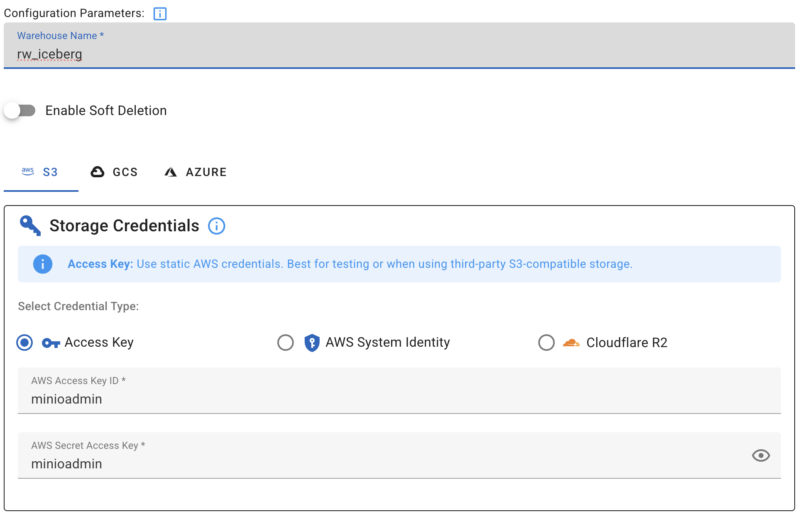
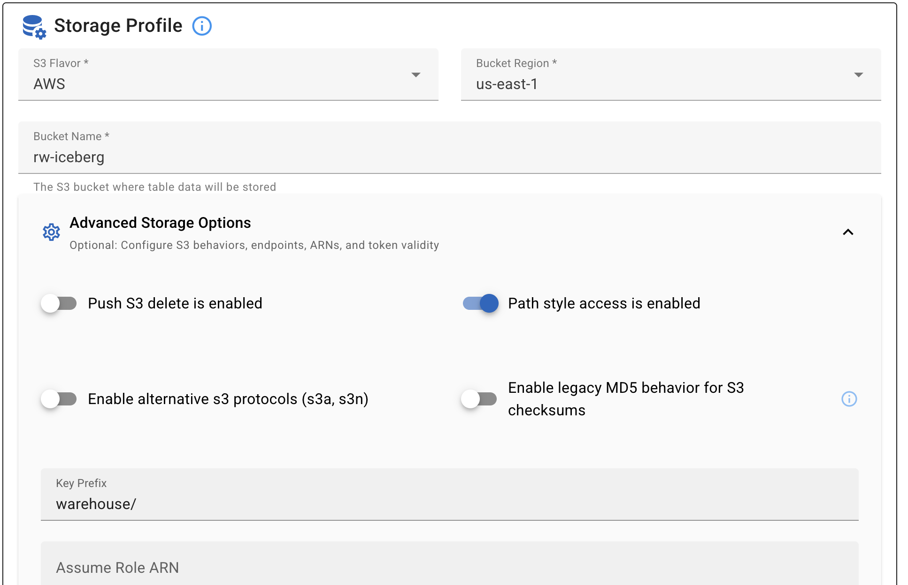
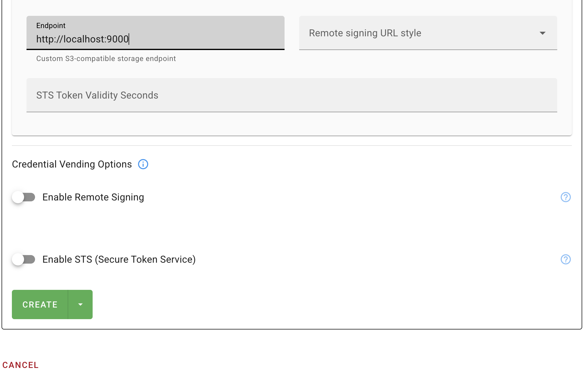

## Background & Solution

In modern network operations (NetOps), real-time detection of anomalies like high latency, excessive packet loss, and bandwidth saturation is critical to preventing outages. However, traditional batch processing systems cause unacceptable detection delays, while complex stream processing frameworks require heavy coding and maintenance, creating barriers for agile teams.

To fill this gap, we’ve built a lightweight end-to-end demo combining **Kafka** (high-throughput ingestion), **RisingWave** (SQL-native stream processing), **Iceberg** (data lake persistence), and **MinIO** (object storage). RisingWave eliminates the complexity of traditional frameworks, allowing NetOps teams to focus on defining anomaly rules with simple SQL, and achieves instant anomaly detection, historical data traceability, and user-friendly monitoring with minimal operational overhead.


## QuickStart

### Prerequisites

Ensure that [RisingWave](https://docs.risingwave.com/get-started/quickstart), [Minio](https://www.min.io/download) and [Kafka](https://kafka.apache.org/) have been successfully installed!

> #### **Configuration of RisingWave Connection to Iceberg Data Lake.**
>
> We use MinIO as the storage backend for Iceberg. As a lightweight, S3-compatible storage service, MinIO is ideal for local testing.
>
> **Step 1: Create a bucket**
>
> Start the MinIO service, open the MinIO Console (the initial username and password are both `minioadmin`), and create a bucket (for example, named `rw-iceberg`).
>
> **Step 2: Configure the catalog service**
>
> Since the built-in catalog service of RisingWave requires PostgreSQL or MySQL as the metastore backend (SQLite is not supported), we use [Lakekeeper][https://docs.lakekeeper.io/getting-started/] as a REST catalog in this demo.
>
> Install and start the Lakekeeper service, open the Lakekeeper Web UI, and create a warehouse (for example, named `rw_iceberg`). 
>
> 
>
> Here, the `Access Key` is the login password of MinIO, the `Bucket Name` must be consistent with the bucket created in MinIO, and the `Endpoint` is the port of the MinIO service. (It is recommended to uncheck "Enable Remote Signing" to avoid potential CORS issues later.)
>
> **Step 3: Create an Iceberg connection in RisingWave**
>
> ```sql
> CREATE CONNECTION iceberg_minio_conn WITH (
>     type = 'iceberg',
>     catalog.type = 'rest',
>     catalog.uri = 'http://localhost:8181/catalog',
>     warehouse.path = 'rw_iceberg',
>     s3.endpoint = 'http://localhost:9000',
>     s3.access.key = 'minioadmin',
>     s3.secret.key = 'minioadmin',
>     s3.region = 'us-east-1',
>     s3.path.style.access = 'true'
> );
> ```

### Quick Start

1. **Clone the Repository.**

   ```shell
   git clone <https://github.com/risingwavelabs/awesome-stream-processing.git>
   ```

2. **Go to the demo directory.**

   ```shell
   cd telecommunication
   ```

3. **Run the initial shell script to create Kafka topics and tables in RisingWave\.**

   ```shell
   sh initialize.sh
   ```

4. **Run the python script to generate data.**

   ```shell
   python generate_data.py
   ```

5. **Run the Backedend Server.**

   ```shell
   python backend.py
   ```

6. **Launch the dashboard.**

   Open `dashboard.html` in your browser.


## Dashboard Visualization


**Live Anomaly Overview & Granular Filtering**

The dashboard’s control bar puts full control over anomaly visibility at your fingertips:

- **Keyword search**: Filter by device ID or time window directly in the search bar.
- **Time range controls**:
  - Custom date/time pickers (pre-populated with a 24-hour window by default).
  - Quick-select buttons: "Last 10m", "Last 1h", "Last 24h", or "All time" (with "Last 24h" highlighted as the active view).
- **Anomaly type toggles**: Check/uncheck boxes to filter by "High Latency", "High Packet Loss", or "Bandwidth Saturation" (all enabled by default).

**Anomaly Details & Context**

The core results grid displays real-time anomaly events with critical operational context:

- `Device`: Unique ID of the affected network asset.
- `Time`: Timestamp of the 10-second aggregation window.
- `Average Latency`: 10-second rolling average (in ms).
- `Average Packet Loss`: 10-second rolling average.
- `Average Bandwidth`: 10-second rolling average.
- `Anomalies Type`: Color-coded tags to identify which rules the event triggered (supports multiple tags per event, like `switch-01` showing all three anomaly types).


## **The Technical Architecture**

Here’s the end-to-end data flow, from network devices to the dashboard:


### **1. Data Capture (Network Devices → Kafka)**

Network devices (or simulators) stream metrics in JSON format to a Kafka topic. Each message includes:

- Device ID, timestamp, source/destination IP, protocol
- Latency, packet loss rate, bandwidth usage
- Traffic flow bytes

In this demo, we use a Python-based simulator (included in the demo) to generate test data—both normal and abnormal readings—to validate anomaly detection.

### **2. Stream Processing (RisingWave)**

**Step 1: Ingest Data from Kafka**

Create a source table to connect RisingWave to Kafka and ingest the metric stream:

```sql
CREATE SOURCE network_metrics_source (
    device_id VARCHAR,
    timestamp TIMESTAMP,
    src_ip VARCHAR,
    dst_ip VARCHAR,
    protocol VARCHAR,
    latency_ms FLOAT,
    packet_loss_rate FLOAT,
    bandwidth_usage_percent FLOAT,
    flow_bytes BIGINT
) WITH (
    connector = 'kafka',
    topic = 'network_metrics',
    properties.bootstrap.server = 'localhost:9092',
    scan.startup.mode = 'earliest'
) FORMAT PLAIN ENCODE JSON;
```

**Step 2: Aggregate Metrics with Window Functions**

Create a materialized view to compute 10-second rolling averages for key metrics (grouped by device):

```sql
CREATE MATERIALIZED VIEW device_metrics_10s AS
SELECT
    device_id,
    window_start,
    window_end,
    AVG(latency_ms) AS avg_latency_ms,
    AVG(packet_loss_rate) AS avg_packet_loss_rate,
    AVG(bandwidth_usage_percent) AS avg_bandwidth_usage,
    SUM(flow_bytes) AS total_flow_bytes
FROM TUMBLE(network_metrics_source, timestamp, INTERVAL '10 seconds')
GROUP BY device_id, window_start, window_end;
```

**Step 3: Detect Anomalies with Custom Rules**

Define anomaly logic (matching the dashboard’s thresholds) and create a materialized view to track only abnormal events:

```sql
CREATE MATERIALIZED VIEW network_anomalies AS
SELECT
    device_id,
    window_start,
    window_end,
    avg_latency_ms,
    avg_packet_loss_rate,
    avg_bandwidth_usage,
    avg_latency_ms > 100 AS is_high_latency,
    avg_packet_loss_rate > 5 AS is_high_packet_loss,
    avg_bandwidth_usage > 90 AS is_bandwidth_saturation
FROM device_metrics_10s
WHERE avg_latency_ms > 100 OR avg_packet_loss_rate > 5 OR avg_bandwidth_usage > 90;
```

**Step 4: Persist Anomalies to Iceberg/MinIO**

Sink the anomaly data to an Iceberg table (stored in MinIO) for long-term retention and historical analysis:

```sql
-- Create connection to Iceberg + MinIO
CREATE CONNECTION iceberg_minio_conn WITH (
    type = 'iceberg',
    catalog.type = 'rest',
    catalog.uri = '<http://localhost:8181/catalog>',
    warehouse.path = 'rw_iceberg',
    s3.endpoint = '<http://localhost:9000>',
    s3.access.key = 'minioadmin',
    s3.secret.key = 'minioadmin',
    s3.region = 'us-east-1',
    s3.path.style.access = 'true'
);

-- Create sink to Iceberg table
CREATE SINK sink_network_anomalies
FROM network_anomalies
WITH (
    connector = 'iceberg',
    type = 'append-only',
    force_append_only = 'true',
    connection = public.iceberg_minio_conn,
    database.name = 'public',
    table.name = 'network_anomalies_history',
    create_table_if_not_exists = 'true'
);
```

### **3. Real-Time Dashboard (FastAPI + Frontend Dashboard)**

A lightweight FastAPI backend (integrated with pyiceberg) offers RESTful endpoints for filtering, sorting, and pagination. The Tailwind CSS + vanilla JavaScript frontend connects to it, displaying real-time anomalies, updating results dynamically via filters (device, time, anomaly type), and using color-coded tags for quick triage.