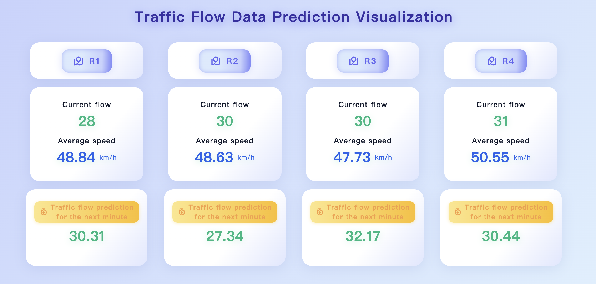
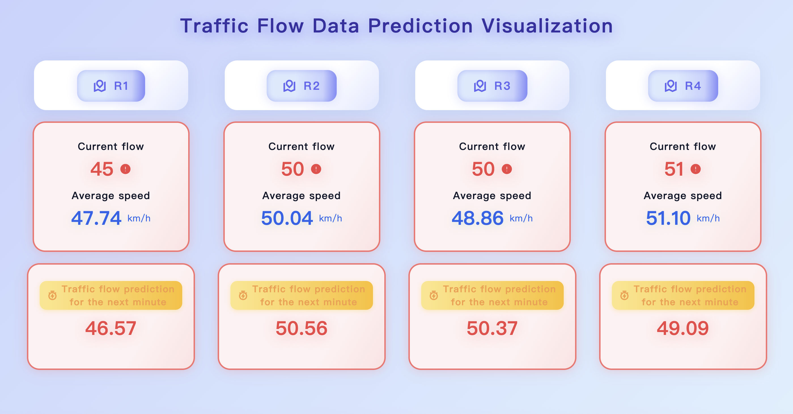
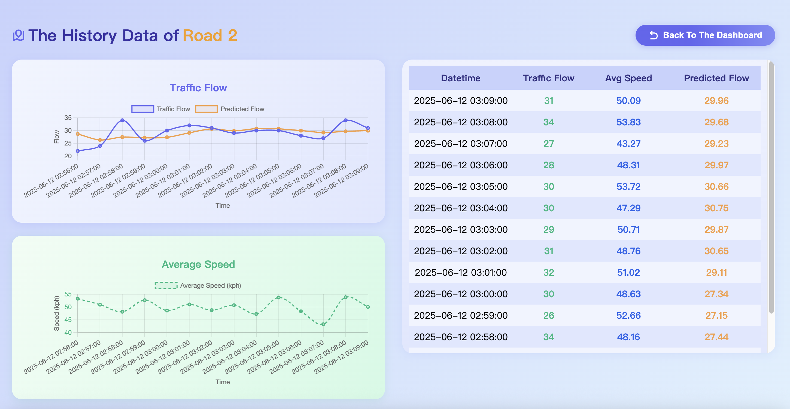
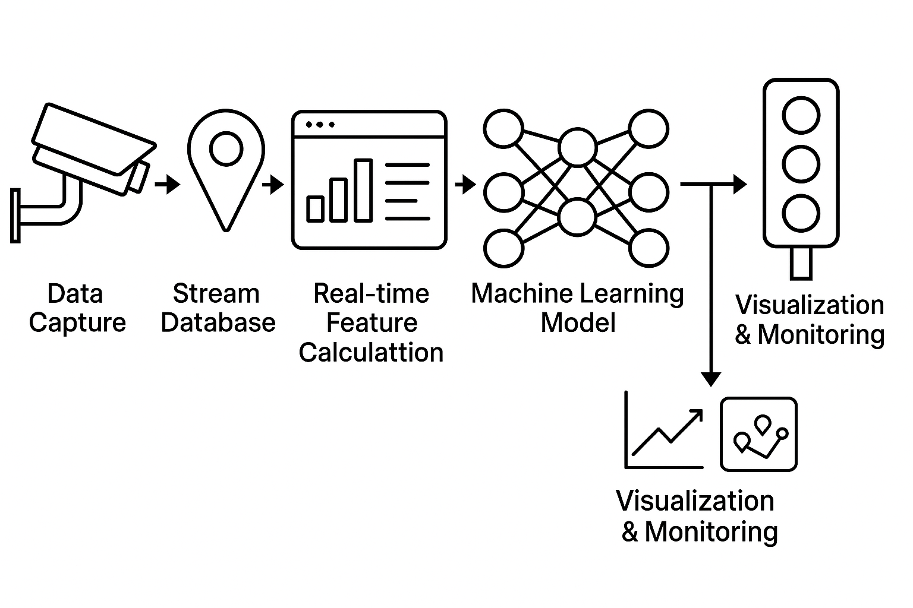

# <center>Feature Engineering Use Case (Real-Time Traffic Prediction Demo)</center>

## Background

Traffic flow prediction has a wide range of applications in today’s era of intelligent systems. Adjusting traffic light timings based on the flow of vehicles at intersections can significantly enhance traffic safety. At the same time, such predictions can also be applied to navigation systems, improving route planning and overall travel efficiency.

However, in the field of machine learning, traditional methods of real-time feature extraction are often inefficient, requiring significant time and computational resources. This is precisely where **RisingWave** excels. By leveraging stream processing, RisingWave can effortlessly extract features from raw data and feed them into models for computation—greatly accelerating the entire process.

In this article, we’ll showcase a simple demo—a **real-time traffic prediction system**—to demonstrate the powerful role that the RisingWave database can play in machine learning applications.


## Launch The Demo

### Prerequisites

Ensure that [RisingWave](https://docs.risingwave.com/get-started/quickstart) and [Kafka](https://kafka.apache.org/) have been successfully installed!

### Quick Start

1. **Clone the Repository.**

   ```bash
   git clone <https://github.com/risingwavelabs/awesome-stream-processing.git>
   ```

2. **Go to the demo directory.**

   ```bash
   cd traffic-prediction
   ```

3. **Run the shell script to create Kafka topics and RisingWave database tables.**

   ```bash
   sh create_tables.sh
   ```

4. **Start the Python script that simulates data generation.**

   ```bash
   pip install -r requirements.txt
   Python generate_data.py
   ```

5. **Start the prediction script.**

   ```bash
   Python traffic_prediction.py
   ```

6. **Create a WebSocket server.**

   ```bash
   cd front-end
   npm install
   node socket.js
   ```

7. **Launch the dashboard**

   Open `index.html` in your browser.


## Dashboard Visualization



The main interface displays the current traffic flow, average speed, and predicted traffic flow for each road. When the traffic flow exceeds 40, it will be displayed as an alert.



By clicking on each road, the charts and tables will clearly display the historical data and prediction results for that road over the past three hours.




## Data Flow Overview



1. **Data Capture**

   - **Smart Cameras:** Capture vehicle images to identify vehicle types and speeds.
   - **Ground Sensors:** Detect the number of vehicles passing by.

2. **Stream Processing (Extracting Required Features from Raw Data)**

   Data streams captured from the above sources are transmitted to the **RisingWave** database via a message queue (e.g., **Kafka**).

   Feature extraction from the incoming data (computed in real time using **materialized views** within the database):

   - **Traffic flow**: Number of vehicles per lane per minute.
   - **Average speed**: Average vehicle speed per lane per minute.

   Due to the large flow of raw data, we do not store it directly. Instead, we store only the computed data features (eg. per-minute traffic flow) in the RisingWave database.

3. **Predicting**

   The features are fed as input parameters into a real-time traffic prediction model (we may use  **LSTM** as a reference for demo), which then outputs the predicted results.

   Some preprocessing (e.g., normalization or standardization) may be needed before model input, and this will be done using Python.

4. **Data Visualization**

   To provide a more intuitive presentation of the results, we will build a dashboard that visualizes to display the prediction outputs. This dashboard may include key metrics such as per-intersection traffic flow, traffic signal statuses, and congestion alerts.


## Sample Data 

### 1 - Raw Data

In general, raw traffic data is captured in real time through devices such as traffic cameras and ground sensors, which record vehicle movement information. In this demo, to simulate real-world traffic scenarios, we use a Python script to automatically generate raw data. 

**Sample Data:**

1. **Raw data captured by cameras**

   ```json
   {
     "timestamp": "2025-06-07T19:14:55.600Z",
     "device_id": "CAM1",
     "road_id": "R1",
     "vehicle_type": "bus",
     "license_plate": "A123456",
     "vehicle_speed_kph": 38.6
   }
   ```
   
2. **Raw data captured by ground sensors**

   ```json
   {
   	"timestamp_entry": "2025-06-07T19:14.56.105Z",
     "timestamp_exit": "2025-06-07T19:14:56.600Z",
     "sensor_id": "SEN1",
     "road_id": "R2",
     "vehicle_speed_kph": 41.2,
    }
   ```

### 2 - Real-Time Feature Data

Real-time feature data is retrieved from materialized views in RisingWave. 

The first column of the table is the road ID, the second column is the start time of the statistics (usually at the beginning of a minute), and the third and fourth columns store two features: the total traffic flow and the average speed within one minute, respectively.

Since our prediction model is based on a 5-step time interval, we typically read features from five consecutive time periods for each road.

**Sample Data:**

```json
['R1' datetime.datetime(2025, 6, 9, 21, 30) 35 42.34571428571428]
 ['R1' datetime.datetime(2025, 6, 9, 21, 31) 36 53.78333333333334]
 ['R1' datetime.datetime(2025, 6, 9, 21, 32) 29 52.04482758620689]
 ['R1' datetime.datetime(2025, 6, 9, 21, 33) 31 51.264516129032266]
 ['R1' datetime.datetime(2025, 6, 9, 21, 34) 33 53.209090909090904]
 ['R2' datetime.datetime(2025, 6, 9, 21, 30) 33 42.36666666666667]
 ['R2' datetime.datetime(2025, 6, 9, 21, 31) 27 50.24074074074074]
 ['R2' datetime.datetime(2025, 6, 9, 21, 32) 28 46.078571428571436]
 ['R2' datetime.datetime(2025, 6, 9, 21, 33) 31 50.81290322580645]
 ['R2' datetime.datetime(2025, 6, 9, 21, 34) 20 54.379999999999995]
 ['R3' datetime.datetime(2025, 6, 9, 21, 30) 23 40.786956521739135]
 ['R3' datetime.datetime(2025, 6, 9, 21, 31) 27 54.50740740740742]
 ['R3' datetime.datetime(2025, 6, 9, 21, 32) 27 56.777777777777786]
 ['R3' datetime.datetime(2025, 6, 9, 21, 33) 26 50.28846153846154]
 ['R3' datetime.datetime(2025, 6, 9, 21, 34) 35 47.597142857142856]
 ['R4' datetime.datetime(2025, 6, 9, 21, 30) 27 44.1037037037037]
 ['R4' datetime.datetime(2025, 6, 9, 21, 31) 29 47.610344827586204]
 ['R4' datetime.datetime(2025, 6, 9, 21, 32) 34 49.035294117647055]
 ['R4' datetime.datetime(2025, 6, 9, 21, 33) 31 48.216129032258074]
 ['R4' datetime.datetime(2025, 6, 9, 21, 34) 30 47.76000000000001]]
```

### 3 - Data Format Conversion

The retrieved data is transformed into the format required by the prediction model. Specifically, it is converted into a 3-dimensional array with the shape `[number of roads, timesteps, features]`.

**Sample Data:**

```json
[[[35.         42.34571429]
  [36.         53.78333333]
  [29.         52.04482759]
  [31.         51.26451613]
  [33.         53.20909091]]

 [[33.         42.36666667]
  [27.         50.24074074]
  [28.         46.07857143]
  [31.         50.81290323]
  [20.         54.38      ]]

 [[23.         40.78695652]
  [27.         54.50740741]
  [27.         56.77777778]
  [26.         50.28846154]
  [35.         47.59714286]]

 [[27.         44.1037037 ]
  [29.         47.61034483]
  [34.         49.03529412]
  [31.         48.21612903]
  [30.         47.76      ]]]
```

### 4 - Prediction Result Outputs

Our LSTM model processes the input data and generates an output array that contains the predicted traffic flow for each road segment.

**Sample Data:**

```json
[33.73733866 30.37113148 28.30455649 27.83868682]
```

### 5 - Data Storage

The real-time feature data and the corresponding traffic flow predictions are stored in the database as structured records, enabling downstream tasks such as analytical processing and visualization.

**Sample Data:**

```json
{
  'id': 7337838650836852736, 
  'road_id': 'R1', 
  'datetime': '2025-06-09T21:50:00', 
  'traffic_flow': 29, 
  'avg_speed_kph': 51.220689655172414, 
  'predicted_flow_next_minute': 33.73733866214752
}
```

### 6 - Data Visualization

Retrive traffic flow data within the past 3 hours from the database and transmit them to the frontend for processing and visualization.

**Sample Data:**

```json
[
  [
    {
      'road_id': 'R1', 
      'datetime': '2025-06-09 21:43:00', 
      'avg_speed_kph': 51.57142857142857, 
      'traffic_flow': 35.0, 
      'predicted_flow_next_minute': 28.60938262939453
    }, 
    {
      'road_id': 'R1', 
      'datetime': '2025-06-09 21:42:00', 
      'avg_speed_kph': 52.56153846153845, 
      'traffic_flow': 26.0, 
      'predicted_flow_next_minute': 28.036925792694092
    },
    ...
  ], 
  ...
  [
    {
      'road_id': 'R4', 
      'datetime': '2025-06-09 21:43:00', 
      'avg_speed_kph': 47.63939393939393, 
      'traffic_flow': 33.0, 
      'predicted_flow_next_minute': 32.082712173461914
    }, 
    {
      'road_id': 'R4', 
      'datetime': '2025-06-09 21:42:00', 
      'avg_speed_kph': 43.38611111111111, 
      'traffic_flow': 36.0, 
      'predicted_flow_next_minute': 32.638587951660156
    },
    ...
  ]
]
```


## Building the Pipeline

### 1. Real-time Captured Data -> RisingWave Database

1. **Simulate real-time data using a Python script and publish it to Kafka.**

   Connect to **Kafka**.

   ```Python
   producer = KafkaProducer(
       bootstrap_servers='localhost:9092',
       value_serializer=lambda v: json.dumps(v).encode('utf-8')
   )
   ```

   Send two messages per second to Kafka.

   ```Python
   while True:
       sensor_data = generate_sensor_data(speed, road_id)
       camera_data = generate_camera_data(speed, road_id)
       producer.send('sensor-data', sensor_data)
       producer.send('camera-data', camera_data)
       time.sleep(0.5)
   ```

   The format of raw data has already been specified in the Sample Data. For demonstration purposes in this demo, we assume that there are four roads: R1, R2, R3, and R4.

2. **RisingWave database reads data from Kafka.**

   Since the raw data does not need to be stored, we use the `CREATE SOURCE` command instead of `CREATE TABLE` and store the collected data in `camera_stream` and `sensor_stream` respectively.

   ```sql
   -- Camera stream
   CREATE SOURCE camera_stream (
       timestamp TIMESTAMP,
       device_id VARCHAR,
       road_id VARCHAR,
       vehicle_type VARCHAR,
       license_plate VARCHAR,
       vehicle_speed_kph FLOAT,
   ) WITH (
       connector='kafka',
       topic='camera-data',
       properties.bootstrap.server='localhost:9092'
   ) FORMAT PLAIN ENCODE JSON;
   
   --sensor stream
   CREATE SOURCE sensor_stream (
       timestamp_entry TIMESTAMP,
       timestamp_exit TIMESTAMP,
       sensor_id VARCHAR,
       road_id VARCHAR,
       vehicle_speed_kph FLOAT,
   ) WITH (
       connector='kafka',
       topic='sensor-data',
       properties.bootstrap.server='localhost:9092'
   ) FORMAT PLAIN ENCODE JSON;
   ```

### 2. Raw Data Stream -> Real-Time Features

At this step, we use RisingWave’s **materialized views** (which support incremental data processing) to transform the data from the two streams into a feature table.

We use a **sliding window** (`TUNBLE` command) to compute the traffic flow `ct` and average speed `spd` for each road every minute.

```sql
--ct (traffic flow per minute)
SELECT
    road_id,
    window_start,
    COUNT(*) AS vehicle_count
FROM TUMBLE(sensor_stream,
            timestamp_entry,
            INTERVAL '1 minute')
GROUP BY road_id, window_start

--spd (average speed per minute)
SELECT
    road_id,
    window_start,
    AVG(vehicle_speed_kph) AS avg_speed_kph
FROM TUMBLE(camera_stream,
            timestamp,
            INTERVAL '1 minute')
GROUP BY road_id, window_start
```

For easier querying, we join the two tables into a single materialized view `features`.

```sql
CREATE MATERIALIZED VIEW features AS
SELECT 
	ct.road_id AS road_id, 
	ct.window_start AS window_start, 
	ct.vehicle_count AS vehicle_count, 
	spd.avg_speed_kph AS avg_speed_kph
FROM ct left join spd
ON ct.road_id = spd.road_id and ct.window_start = spd.window_start;
```

Since the time window is set to 5, meaning we use data from the previous 5 time intervals to predict the next one, we only need to retain data from the last 5 minutes. Actually , we need to retrieve data from  $t - 6$ minutes to $t - 1 $minute, because we are predicting the data for the current minute.

```sql
CREATE MATERIALIZED VIEW features_last_5min AS
SELECT *
FROM features
WHERE window_start <= NOW() - INTERVAL '1 minute' AND window_start >= NOW() - INTERVAL '6 minutes';
```

`features_last_5min` is the final materialized view we need. It stores the total number of vehicles and the average speed for each road at every minute within the past 5 minutes. The output data format is shown in the sample data.

### 3. Real-Time Features -> Model Prediction Results

1. **Read data from the database.**

   Connect to RisingWave.

   ```Python
   rw = RisingWave(
       RisingWaveConnOptions.from_connection_info(
           host="localhost", port=4566, user="root", password="root", database="dev"
       )
   )
   ```

   Read data from materialized view, sort the timestanp in ascending order.

   ```Python
   def fetch_features():
       data = rw.fetch(f"""
                               SELECT *
                               FROM features_last_5min
                               ORDER BY road_id, window_start;
                               """)
       return np.array(data)
   ```

2. **Process the data format for model input.**

   Note that prediction is only performed when the data retrieved from the materialized view meets the model’s input requirements — specifically, when data from 5 time windows is available. If fewer than 5 time windows are obtained, no prediction is made.

   The data we read is a $20 \times 4$ array, with the last two columns containing the feature we need. We take the last two columns, resulting in a  $20 \times 2$  array.

   ```Python
   data = data[:, 2:4].astype(float)
   ```

   Normalize the data.

   ```Python
   sc = MinMaxScaler(feature_range=(0, 1))
   data_sc = sc.fit_transform(data)
   ```

   Since we need to make separate predictions for each road, we use the road ID as a new dimension, reshaping the array into a $4 \times 5 \times 2$ shape.

   ```Python
   data_sc = np.reshape(data_sc, [4, 5, 2])
   ```

3. **Input the data into the model and output the prediction results.**

   > In this demo, we use a TensorFlow LSTM model for prediction, which consists of two LSTM layers, two dropout layers, and one fully connected layer. I have already pre-trained the model using traffic data from the California highway network PeMS. The model is saved in the `model` directory, so we won’t go into further details here.

   ```Python
   # load LSTM model
   lstm_model = load_model('model/traffic_prediction_model.keras')
   # predict
   pre_flow = lstm_model.predict(data_sc)
   # denormalization
   pre_flow = inv_transform(pre_flow)
   ```

   The final output is a $4 \times 1$ array, representing the predicted traffic flow for each road. For details, refer to the sample data section.

### 4. Persistent Storage

The structure of the persistent table `traffic_flow` is as follows:

```Python
CREATE TABLE traffic_flow (
    id BIGINT PRIMARY KEY,
    road_id VARCHAR,
    datetime TIMESTAMP,
    avg_speed_kph FLOAT,
    traffic_flow FLOAT,
    predicted_flow_next_minute FLOAT
) WITH (
    connector='kafka',
    topic='traffic-flow',
    properties.bootstrap.server='localhost:9092'
) FORMAT PLAIN ENCODE JSON;
```

We still use Kafka as the bridge for sending and receiving data from Python script to database. The format of the data to be sent is shown in the sample data.

### 5. Storaged Data -> Dashboard

Since we display data from the past 3 hours on the front-end dashboard, we also use a sliding window in RisingWave to filter data from the `traffic_flow` table.

```sql
CREATE MATERIALIZED VIEW history_flow AS
SELECT road_id, datetime, avg_speed_kph, traffic_flow, predicted_flow_next_minute
FROM traffic_flow
WHERE datetime >= NOW() - INTERVAL '3 hours';
```

Read the 3-hour historical data for each road and push it to the dashboard via Kafka for display.

```Python
display_data = []
for i in range(roads):
  fetched_data = rw.fetch(f"select * from history_flow where road_id = 'R{i + 1}' order by datetime desc", format=OutputFormat.DATAFRAME)
  # Remove spaces and NaN values to ensure the data can be parsed by JSON.
  fetched_data['datetime'] = fetched_data['datetime'].astype(str)
  display_data.append(fetched_data.where(pd.notnull(fetched_data), "nan").to_dict(orient="records"))

if len(display_data[0]) > 0:
  producer.send('data-display', display_data)
```

The frontend connects to Kafka via WebSocket to read data and uses React’s useState to update dynamically.

```javascript
const kafka = new Kafka({ brokers: ['localhost:9092'] });
const consumer = kafka.consumer({ groupId: 'data-display' });
const wss = new WebSocket.Server({ port: 5001 });

(async () => {
    await consumer.connect();
    await consumer.subscribe({ topic: 'data-display', fromBeginning: false });
    consumer.run({
        eachMessage: async ({ message }) => {
            const msg = message.value.toString();
            wss.clients.forEach(ws => {
                if (ws.readyState === ws.OPEN) ws.send(msg);
            });
        }
    });
})();

const [historyData, setHistoryData] = React.useState([]);
const [roadData, setRoadData] = React.useState([]);

React.useEffect(() => {
    const ws = new WebSocket("ws://localhost:5001");
    ws.onmessage = (event) => {
        let historyData = JSON.parse(event.data);
        setHistoryData(historyData);
        let roadData = [];
        for (let i = 0; i < historyData.length; i++) {
            roadData.push(historyData[i][0]);
        }
        setRoadData(roadData)
    };
    return () => ws.close();
}, []);
```
