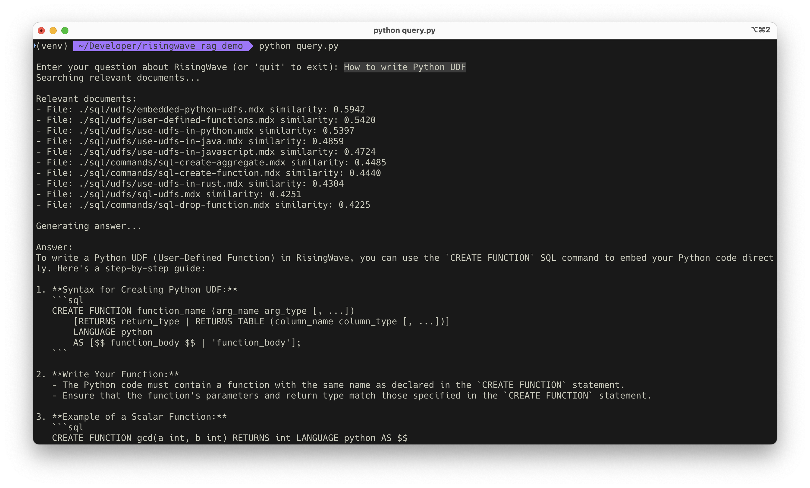

# RisingWave RAG Demo

This is a demo of using RisingWave to build a RAG system to answer questions about RisingWave. The data of RAG is from the [RisingWave docs](https://docs.risingwave.com/). It stores the document contents as well as the embeddings of the documents. 

When a user asks a question, the system will use the question embedding to find the most similar documents from the vector database, and then call LLM model and use the document contents to answer the question.

## Setup

You can use this 1-line command to start the RisingWave server.

```bash
curl -L https://risingwave.com/sh | sh
```

After the server started, create the necessary UDFs and tables.

The following SQL creates a UDF `text_embedding` that uses OpenAI's API to embed a text into a vector. The function relies on the `fetch` API, which is introduced in the latest version of RisingWave.

```sql
CREATE FUNCTION text_embedding(t varchar) RETURNS real[] LANGUAGE javascript AS $$
    export async function text_embedding(t) {
        for (let retries = 0; retries < 3; retries++) {
            try {
                const response = await fetch("https://api.openai.com/v1/embeddings", {
                    method: 'POST',
                    headers: {
                        'Authorization': `Bearer <your-openai-api-key>`,
                        'Content-Type': 'application/json'
                    },
                    body: JSON.stringify({
                        input: t,
                        model: "text-embedding-3-small"
                    })
                });
                if (!response.ok) {
                    const error = await response.json();
                    throw new Error(`OpenAI API error: ${error.error?.message || 'Unknown error'}`);
                }
                const data = await response.json();
                return data.data[0].embedding;
            } catch (error) {
            }
        }
        return null;
    }
$$ WITH (
    async = true,
    batch = false
);
```

Now, create the data pipeline to ingest the documents into the database. In RisingWave, a data pipeline is simply written as a materialized view defined in SQL.

```sql
CREATE TABLE documents (
    file_name VARCHAR,
    content TEXT,
    PRIMARY KEY (file_name)
);

CREATE MATERIALIZED VIEW document_embeddings AS
WITH t AS (
    SELECT
        *, text_embedding(content) AS embedding
    FROM documents
)
SELECT
    file_name,
    content,
    embedding
FROM t
WHERE embedding IS NOT NULL;
```

## Load data

For this demo, we use the documents from the RisingWave docs. 

```bash
git clone https://github.com/risingwavelabs/risingwave-docs.git
cd risingwave-docs

# Load all the documents (`.mdx` files) into the `documents` table
find . -name "*.mdx" | while read -r file; do
    content=$(cat "$file" | sed "s/'/''/g")
    sql_statement="INSERT INTO documents (file_name, content) VALUES ('$file', '$content') ON CONFLICT (file_name) DO UPDATE SET content = EXCLUDED.content;"
    echo "$sql_statement" | psql -h 127.0.0.1 -p 4566 -d dev -U root
    echo "Processed: $file"
done
```

## Query

To compare the similarity between the question and the documents, we need to introduce the `cosine_similarity` UDF.

```sql
CREATE FUNCTION cosine_similarity(v1 real[], v2 real[]) RETURNS real LANGUAGE rust AS $$
    fn cosine_similarity(a: &[f32], b: &[f32]) -> f32 {
        let dot_product: f32 = a.iter().zip(b).map(|(a, b)| a * b).sum();
        let norm_a: f32 = a.iter().map(|a| a * a).sum();
        let norm_b: f32 = b.iter().map(|b| b * b).sum();
        dot_product / (norm_a * norm_b).sqrt()
    }
$$;
```

Now, we can use the `document_embeddings` materialized view to answer questions.

The following SQL uses the `text_embedding` UDF to embed the question, and then finds the top 10 most similar documents from the `document_embeddings` materialized view.

```sql
WITH question_embedding AS (
    SELECT text_embedding('write a Python UDF') as embedding
    LIMIT 1 -- Hack: ensure the function is called once only
)
SELECT 
    d.file_name,
    d.content,
    cosine_similarity(d.embedding, q.embedding) as similarity
FROM document_embeddings d
CROSS JOIN question_embedding q
ORDER BY similarity DESC
LIMIT 10;
```

For your convenience, we provide a Python script to answer questions.

```bash
python query.py
```



## More

